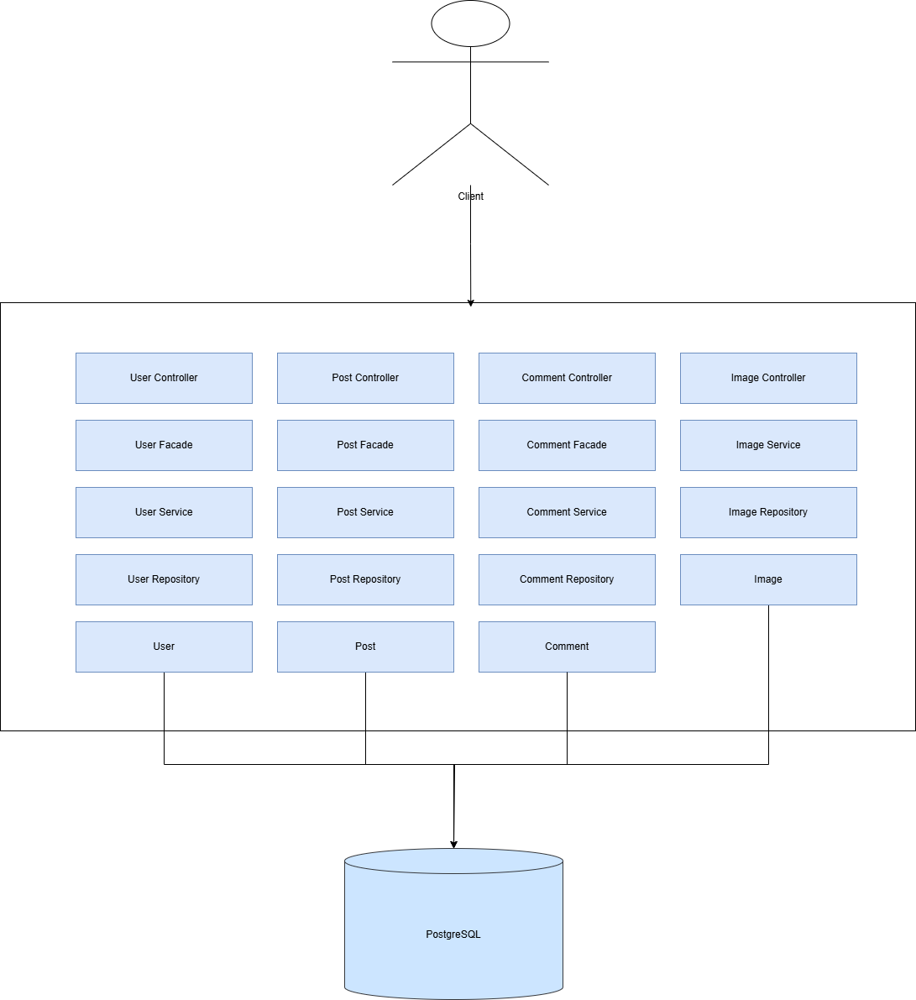
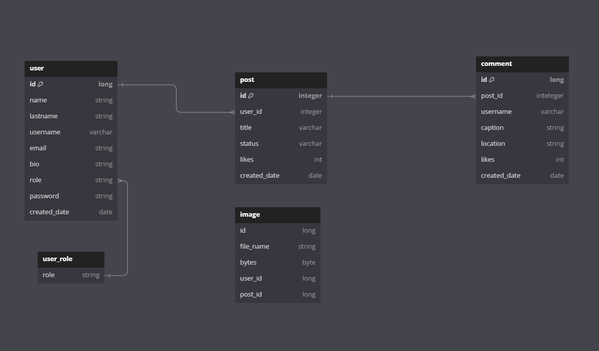

# Instacopy
___
## Description
This is pet-project instagram`s backend.  
Project can:
1. Registration users
2. Create post via user.
3. Comment post via user
4. Add picture to post
___
## Architect

---
## Data model

___
## Resources
| Usage         | Resource                                                                                                                           |
|---------------|------------------------------------------------------------------------------------------------------------------------------------|
| Authorization | 1.POST api/auth/singin 2.POST api/auth/singup                                                                                  |
| User          | 1.GET api/user/  2.GET api/user/:userId  3.POST api/auth/update 4.GET api/user/search/:username                        |
| Post          | 1.POST api/post/create  2.POST api/post/:postId/delete  3.GET api/post/all 4.GET api/post/user/posts                   |
| Comment       | 1.POST api/comment/:postId/create  2.GET api/comment/:postId/all  3.POST api/comment/:commentId/delete                 |
| Image         | 1.POST api/image/upload  2.POST api/image/:postId/upload  3.GET api/image/profileImage  4.POST api/image/:postId/image |

